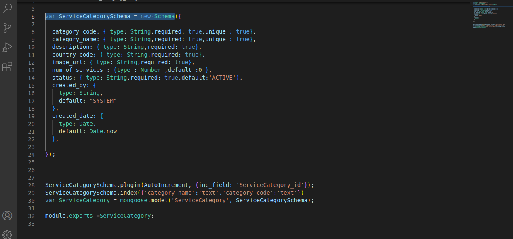

<h3> Client data model for holding the attributes of sign up </h3>

```backend/models/users_mdls.js(var usersSchema=new Schema)```


<h3> Client data model for holding the attributes of sign up</h3>

```backend/models/users_mdls.js(var usersSchema=new Schema)```


<h3>Client Authentication to check if the user has entered a valid username and password for login.</h3>

<h3>Client data models for holding the client attributes of login</h3>


```backend/models/users_mdls.js(var usersSchema=new Schema)```


<h3>Client data model for holding the attributes of the client profile setup </h3>

```backend/models/users_mdls.jsVar UsersSchema = new Schema)```


<h3>Client data model for holding the attributes of resetting the password</h3>

```backend/services/users_srv.js Async function reset_password)```


<h3> Send email for verifying client reset password.</h3>

```backend/interfaces/email.js(const sendEmail=async(to,subject,content,attachment)```


<h3>Data models for holding the attributes of the different services</h3>

```backend/models/services_mdls.js(Var ServicesSchema )```


<h3>Data model for holding the attributes of the service category</h3>

```backend/models/service_category_mdls.js(var ServiceCategorySchema = new Schema)```



<h3>Data models for holding the attributes of the service sub-category </h3>

```backend/models/service_sub_category_mdls.js(var ServiceSubCategorySchema)```


<h3>Data model for holding the attributes of the service provider.</h3>

```backend/models/service_provider_mdls.js(var ServiceProviderSchema = new Schema)```


<h3> data model for holding the data of the client  review</h3>
 
 ```backend/models/reviews_mdls.js(var ReviewSchema = new Schema)```

 

<h3>Data model for getting  the client  review</h3>

 ```backend/controllers/review_ctrl.js(var ReviewSchema = new Schema)```

  

<h3>Data model for holding the terms and condition attributes</h3>

 ```backend/models/terms_condition_mdls.js(Var  TncSchema=new Schema)```

   


