<h3> Client Sign up screen </h3>

```kazi/app/java/ke.co.kaziapp/ui/v1/register activity.kt(class RegisterActivity : NetworkSensingBaseActivity)```

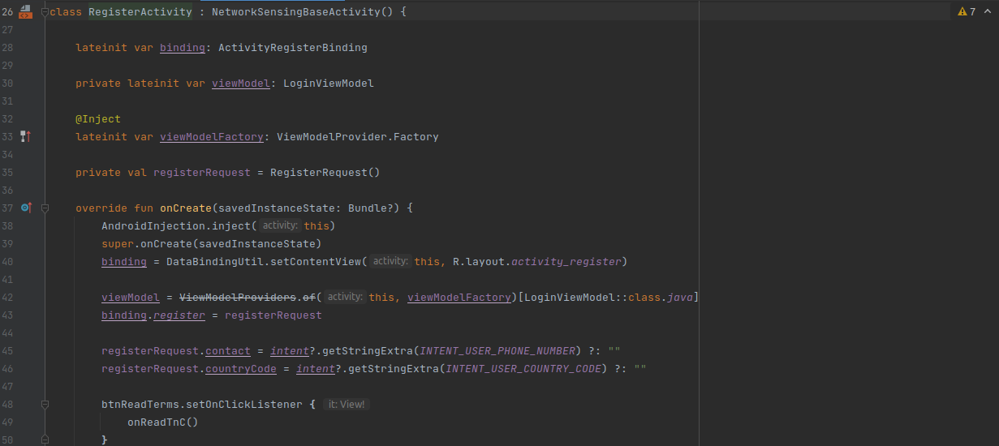
 
<h3> Client Verification for verifying the new account</h3>

``` kazi/appjava/ke.co.kaziapp/ui/v1/GetOtpActivity.kt(class GetOtpActivity : NetworkSensingBaseActivity)```

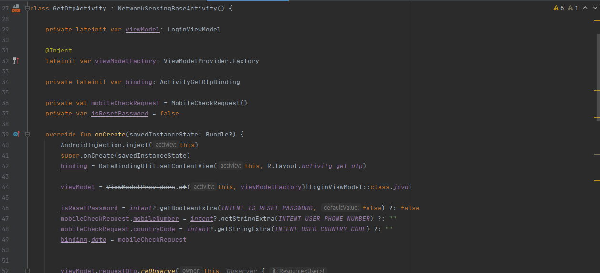

<h3> Client Login screen</h3>

```kazi/app/java/ke.co.kaziapp/ui/v1/login activity.kt(class LoginActivity : NetworkSensingBaseActivity)```


<h3> Client Verification for verifying the existing account </h3>

 
``` kazi/app/java/ke.co.kaziapp/ui/v1/GetOtpActivity.kt(class GetOtpActivity : NetworkSensingBaseActivity)```


<h3> Client set up profile screen</h3>

``` kazi/app/java/ke.co.kaziapp/ui/v1/profilesetting activity.kt(class ProfileSettingsActivity NetworkSensingBaseActivity)```

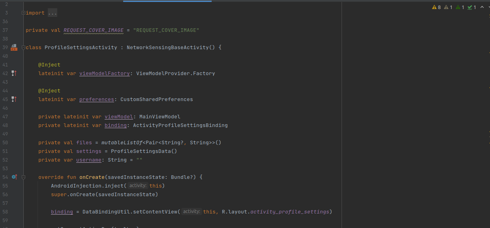


<h3>Client Validation for validating if the client have entered the valid credentials of profile setup.</h3>

```kazi/app/java/ke.co.kaziapp/ui/v1/profilesetting activity.kt(private fun validate)```

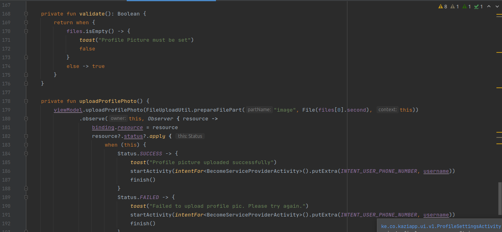


<h3>Notification screen to notify the client of the new services that are available in the application. </h3>

```kazi/app/java/ke.co.kaziapp/src/main/view/client/inbox/notifications/InboxNotificationsAdapter.kt```

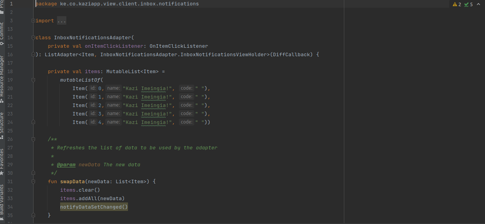

<h3>Client reset password screen </h3>

```kazi/app/java/ke.co.kaziapp/ui/v1/forgot password Activity/private fun resetPassword```

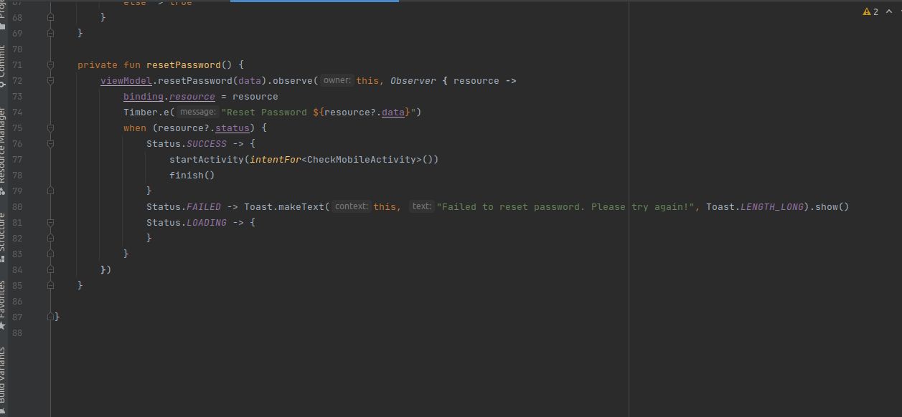

<h3>Explore service screen </h3>

```kazi/app/java/ke.co.kaziapp/ui/v1/servicelistActivity( class ServicesListActivity : NetworkSensingBaseActivity```


<h3>Validation to validate  if the user have entered the valid credentials.</h3>

```kazi/app/java/ke.co.kaziapp/ui/v1/profilesetting activity.kt( private fun validate)```

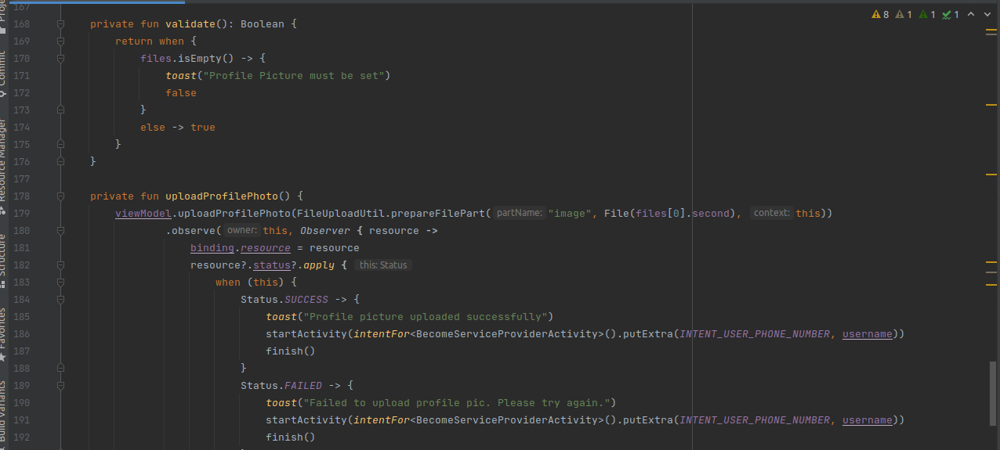

<h3> Explore Service category screen </h3>

```kazi/app/java/ke.co.kaziapp/ui/v1/service category Activity.kt(class ServiceSubCategoryActivity : NetworkSensingBaseActivity)```

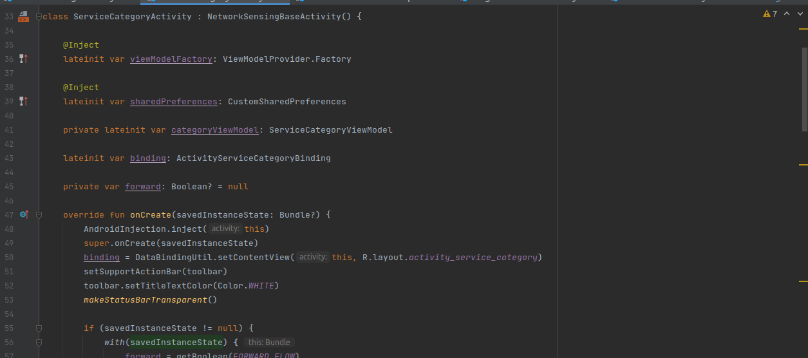

<h3> Service sub-category screen</h3>

```kazi/app/java/ke.co.kaziapp/ui/v1/servicesubcategoryActivity,kt(class ServiceSubCategoryActivity : NetworkSensingBaseActivity)```

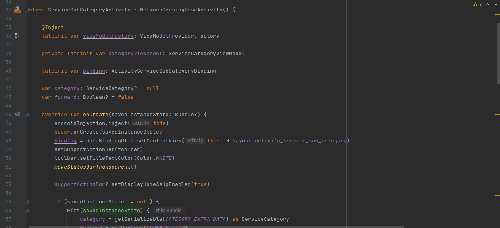


<h3>Service provider screen</h3>

```kazi/app/java/ke.co.kaziapp/ui/v1/serviceproviderinfoActivity,kt( class ServiceProviderInfoActivity : AppCompatActivity)```

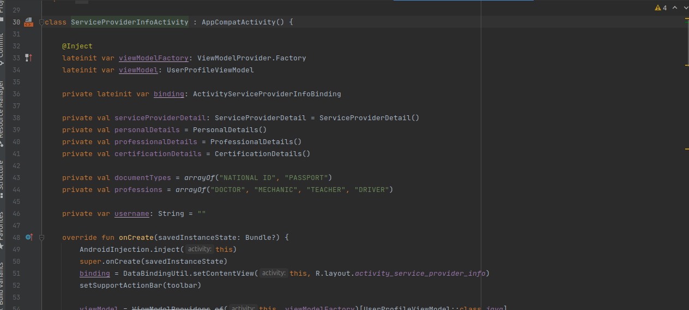

<h3> Client review screen</h3>

```kazi/app/java/ke.co.kaziapp/ui/v1/review/ClientreviewFragment(class ClientReviewsFragment)```

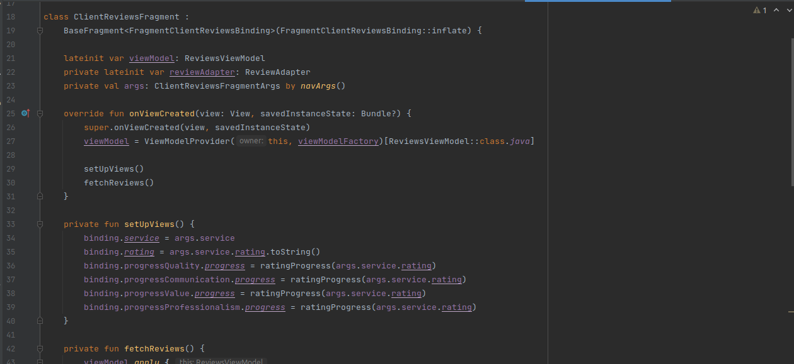


<h3>Terms and condition screen </h3>

```kazi/app/java/ke.co.kaziapp/ui/v1/terms and conditions Activity,kt( class TermAndConditionsActivity : AppCompatActivity)```

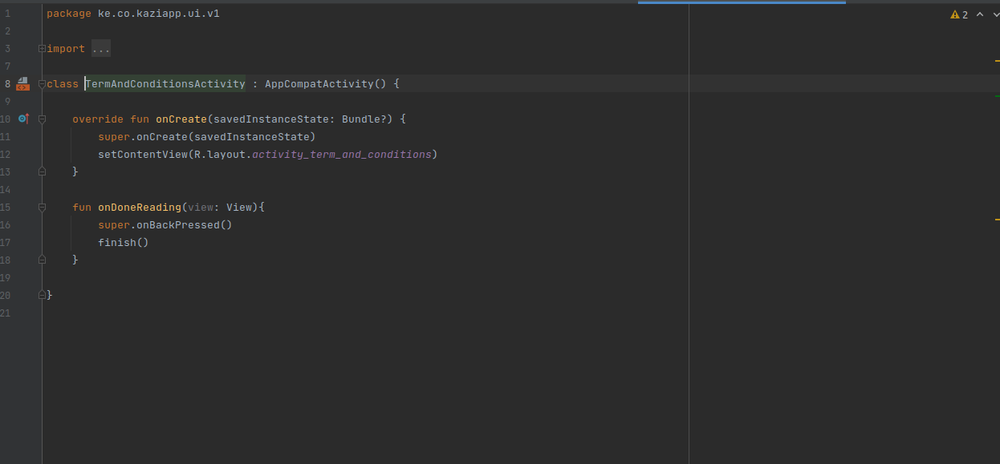

<h3>Chat screen </h3>

```kazi/app/java/ke.co.kaziapp/ui/v1/ChatsActivity.kt( class Terms And Conditions Activity : AppCompatActivity)```


